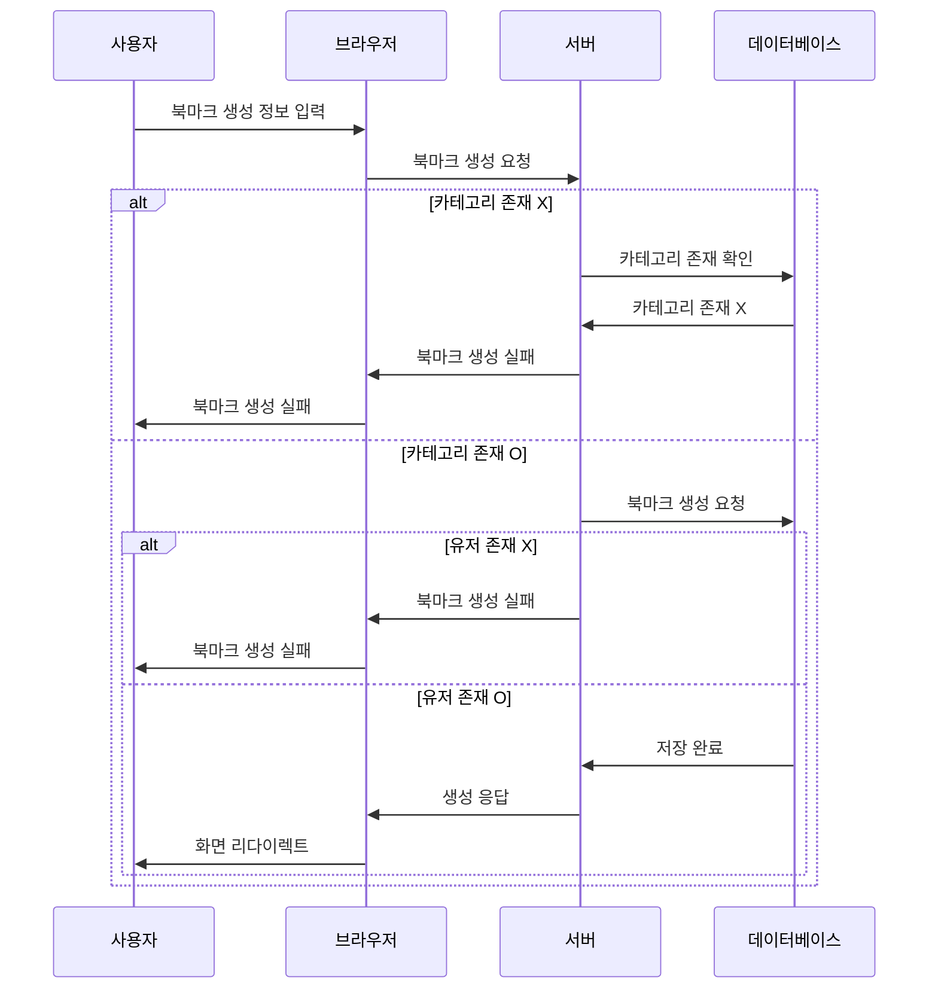

```mermaid
sequenceDiagram
    participant User as 사용자
    participant Browser as 브라우저
    participant Server as 서버
    participant DB as 데이터베이스
    
    User->>Browser: 북마크 생성 정보 입력
    Browser->>Server: 북마크 생성 요청
    alt 카테고리 존재 X
        Server->>DB: 카테고리 존재 확인
        DB->>Server: 카테고리 존재 X
        Server->>Browser: 북마크 생성 실패
        Browser->>User: 북마크 생성 실패
    else 카테고리 존재 O
        Server->>DB: 북마크 생성 요청
    alt 유저 존재 X
        Server->>Browser: 북마크 생성 실패
        Browser->>User: 북마크 생성 실패
    else 유저 존재 O
        DB->>Server: 저장 완료
        Server->>Browser: 생성 응답
        Browser->>User: 화면 리다이렉트
    end
    end
``` 
### 제한사항
- 북마크 URL 길이는 512byte 로 설정 카카오에서도 200자를 제한하고 있으며 그 이상의 값은 잘 들어오지 않음
- 나머지 String은 0~255byte 이내 설정
## 변경예정
- [ ] 인증/인가 구현 시 적용 