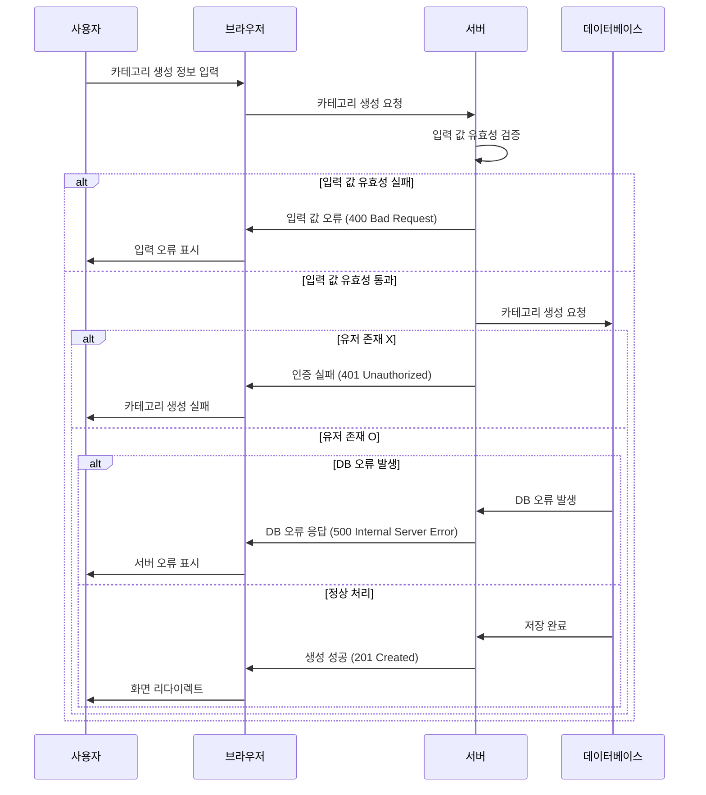

### 제한사항
1. title
   제약 조건:
   - @Size(min = 0, max = 255): 길이는 0에서 255 바이트 사이여야 함.
   메시지: "카테고리명 길이는 0 ~ 255byte로 작성해주세요"
   - @NotBlank: 빈 문자열이 아니어야 함.
   메시지: "카테고리명을 입력해주세요"
2. userId
   제약 조건:
   - @NotEmpty: 값이 비어있으면 안됨.
   메시지: "값을 추가해주세요"
   - @Min(1): 값은 1 이상이어야 함.
   메시지: "1이상의 유저 아이디를 입력해주세요"
## 변경예정
- [ ] 인증/인가 구현 시 적용 