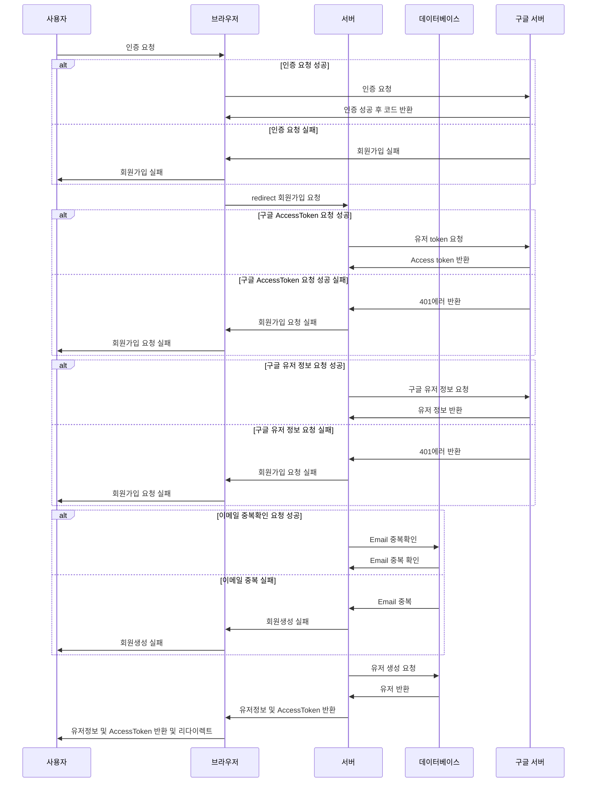

```mermaid
sequenceDiagram
    participant User as 사용자
    participant Browser as 브라우저
    participant Server as 서버
    participant DB as 데이터베이스
    participant Google as 구글 서버
    
    User->>Browser: 인증 요청
    alt 인증 요청 성공
        Browser->>Google: 인증 요청
        Google->>Browser: 인증 성공 후 코드 반환
    else 인증 요청 실패
        Google->>Browser: 회원가입 실패
        Browser->>User: 회원가입 실패
    end
    Browser->>Server: redirect 회원가입 요청
    alt 구글 AccessToken 요청 성공
        Server->>Google: 유저 token 요청
        Google->>Server: Access token 반환
    else 구글 AccessToken 요청 성공 실패
        Google->>Server: 401에러 반환
        Server->>Browser: 회원가입 요청 실패
        Browser->>User: 회원가입 요청 실패
        
    end
    alt 구글 유저 정보 요청 성공
        Server->>Google: 구글 유저 정보 요청
        Google->>Server: 유저 정보 반환
    else 구글 유저 정보 요청 실패
        Google->>Server: 401에러 반환
        Server->>Browser: 회원가입 요청 실패
        Browser->>User: 회원가입 요청 실패
    end
    alt 이메일 중복확인 요청 성공
        Server->>DB: Email 중복확인
        DB->>Server: Email 중복 확인
        
    else 이메일 중복 실패
        DB->>Server: Email 중복
        Server->>Browser: 회원생성 실패
        Browser->>User: 회원생성 실패
    end
    Server->>DB: 유저 생성 요청
    DB->>Server: 유저 반환
    Server->>Browser: 유저정보 및 AccessToken 반환
    Browser->> User: 유저정보 및 AccessToken 반환 및 리다이렉트
    
        
        
    
    
``` 

### Python script 테스트

