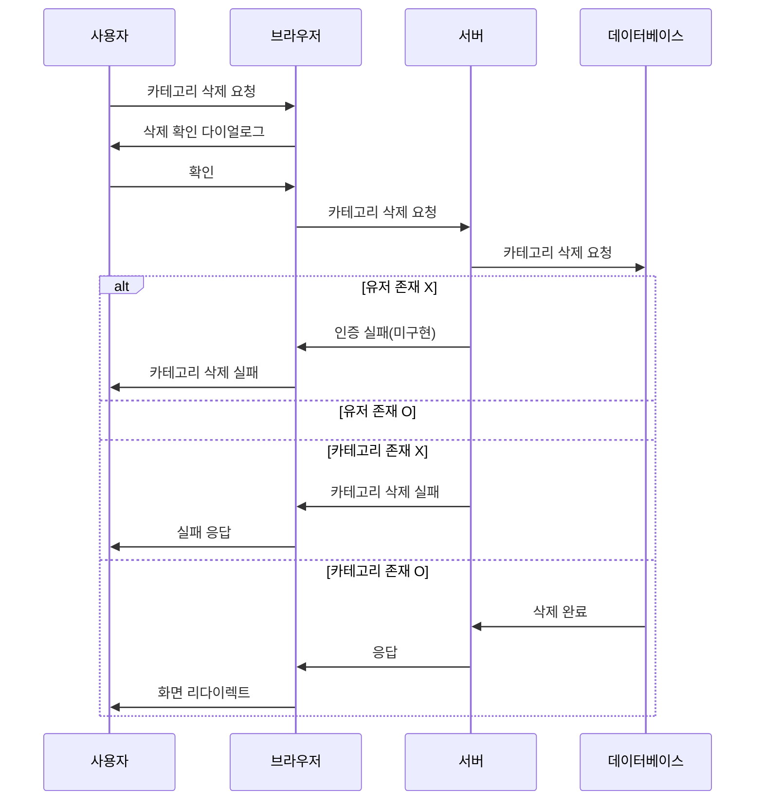

```mermaid
sequenceDiagram
    participant User as 사용자
    participant Browser as 브라우저
    participant Server as 서버
    participant DB as 데이터베이스

    User->>Browser: 카테고리 삭제 요청
    Browser->>User: 삭제 확인 다이얼로그
    User->>Browser: 확인
    Browser->>Server: 카테고리 삭제 요청
    Server->>DB: 카테고리 삭제 요청
    alt 유저 존재 X
        Server->>Browser: 인증 실패(미구현)
        Browser->>User: 카테고리 삭제 실패
    else 유저 존재 O
        else 카테고리 존재 X
            Server->>Browser: 카테고리 삭제 실패
            Browser->>User: 실패 응답    
        else 카테고리 존재 O
            DB->>Server: 삭제 완료
            Server->>Browser: 응답
            Browser->>User: 화면 리다이렉트
    end 
``` 