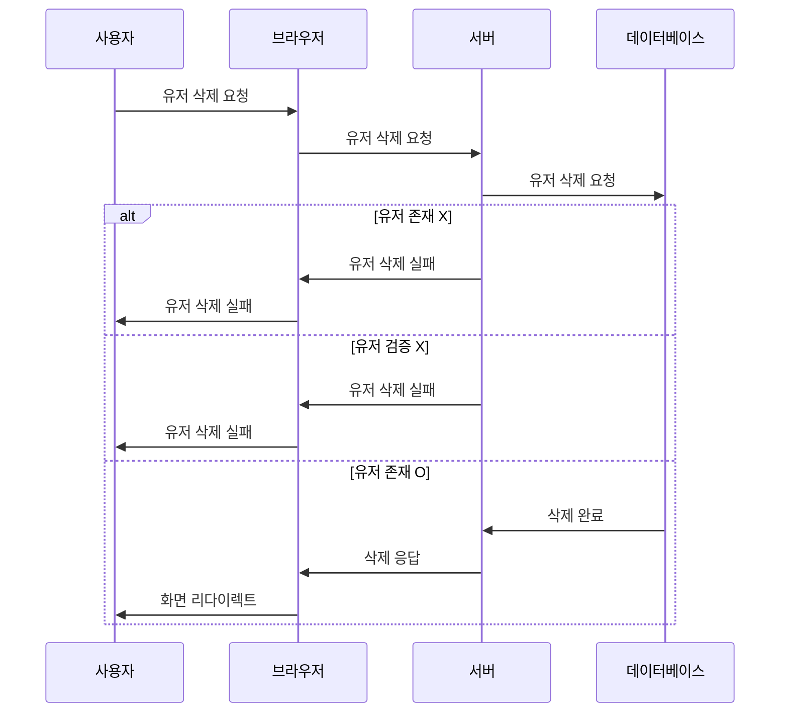

### 제한사항
#### userId 제한사항:
- 값이 비어있으면 안 됨 (@NotEmpty): 값이 반드시 존재해야 하며, 빈 값이나 null은 허용되지 않음.
- 1 이상의 값이어야 함 (@Min(value = 1)): 최소 값이 1이어야 하며, 1 미만의 값은 허용되지 않음.
#### email 제한사항:
- 비어있으면 안 됨 (@NotBlank): 값이 반드시 존재해야 하며, 빈 문자열 또는 공백만 포함된 값은 허용되지 않음.
- 특정 형식의 값 (message = "test@email.com 형식에 맞춰주세요"): 이메일 형식과 같은 특정 형식의 값을 요구함.
#### password 제한사항:
- 비어있으면 안 됨 (@NotBlank): 값이 반드시 존재해야 하며, 빈 문자열 또는 공백만 포함된 값은 허용되지 않음.

## 변경예정
- [ ] 인증/인가 구현 시 적용 