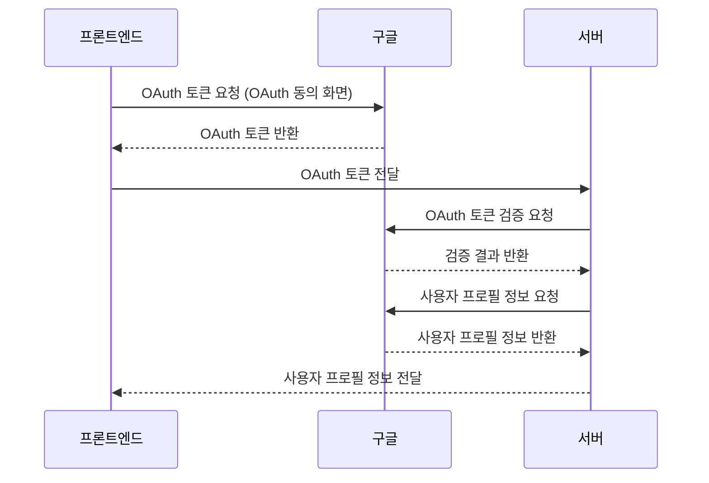
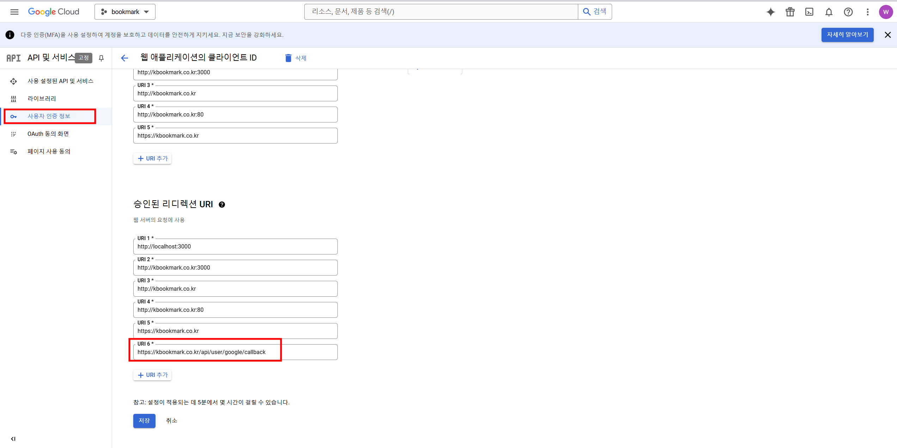

## Sequence Diagram


## Front-end
필요한 parameter와 요청할 URL
```json
        scope: 'https://www.googleapis.com/auth/userinfo.profile https://www.googleapis.com/auth/userinfo.email', // 받고싶은 정보
        access_type: 'online',
        include_granted_scopes: 'true',
        response_type: 'code', 
        redirect_uri: 'https://kbookmark.co.kr',//프론트 엔드로 리다이렉트
        client_id: clientId, //gcp에서 제공하는 client id
```
### 프론트 구글 요청 URL
```javascript
const googleUrl = 'https://accounts.google.com/o/oauth2/v2/auth';
```

### 프론트 최종 코드
```javascript
    // 파라미터 추가
    const params = new URLSearchParams({
        scope: 'https://www.googleapis.com/auth/userinfo.profile https://www.googleapis.com/auth/userinfo.email',
        access_type: 'online',
        include_granted_scopes: 'true',
        response_type: 'code',
        redirect_uri: redirectUrl,
        client_id: clientId,
    });

    const googleOAuthUrl = googleUrl + '?' + params.toString();
    window.location.href = googleOAuthUrl;
```

## Backe-end
필요한 parameter와 요청할 URL
```java
        // 요청 본문에 필요한 데이터 설정
        Map<String, String> data = new HashMap<>();
        data.put("code", code);
        data.put("client_id", clientId); //gcp 클라이언트 키
        data.put("client_secret", secretKey); //gcp 클라이언트 비밀키
        data.put("redirect_uri", "https://kbookmark.co.kr/api/user/google/callback"); //Front에서 Back으로 인증 요청 URL
        data.put("grant_type", grantType);
```
주의해야할 점은 redirect_uri를 [GCP](https://console.cloud.google.com/) 에서도 아래와 같이 설정해주어야 합니다.



### 백엔드 구글 토큰 요청 URL
```java
 private final String GOOGLE_URL_TOKEN = "https://oauth2.googleapis.com/token";
```

### 백엔드 토큰 요청 최종코드

```java
public GoogleTokenInfo getToken(String code) {

        // 요청 본문에 필요한 데이터 설정
        Map<String, String> data = new HashMap<>();
        data.put("code", code);
        data.put("client_id", clientId);
        data.put("client_secret", secretKey);
        data.put("redirect_uri", redirectUri);
        data.put("grant_type", grantType);

        // HTTP 헤더 설정
        HttpHeaders headers = new HttpHeaders();
        headers.set("Content-Type", "application/json");

        // 요청 엔티티 생성
        HttpEntity<Map<String, String>> entity = new HttpEntity<>(data, headers);

        // 액세스 토큰 요청
        ResponseEntity<GoogleTokenInfo> response = restTemplate.exchange(GOOGLE_URL_TOKEN, HttpMethod.POST, entity, GoogleTokenInfo.class);

        if (response.getStatusCode().is2xxSuccessful()) {
            // 액세스 토큰 반환
            return response.getBody();
        } else {
            throw new RuntimeException("Failed to get access token: " + response.getStatusCode() + " - " + response.getBody());
        }


    }
```

### 백엔드 사용자 요청 코드

프로필 요청 URL
```java
    private final String GOOGLE_URL_USER_INFO = "https://www.googleapis.com/oauth2/v3/userinfo";
```
사용자 요청 코드
```java
public GoogleUserInfo getProfile(String accessToken) {
        // HTTP 헤더 설정
        HttpHeaders headers = new HttpHeaders();
        headers.set("Authorization", "Bearer " + accessToken);


        // 요청 엔티티 생성
        HttpEntity<String> entity = new HttpEntity<>(headers);

        // 사용자 프로필 정보 요청
        ResponseEntity<GoogleUserInfo> response = restTemplate.exchange(GOOGLE_URL_USER_INFO, HttpMethod.GET, entity, GoogleUserInfo.class);

        return response.getBody(); // 프로필 정보 반환
    }
```