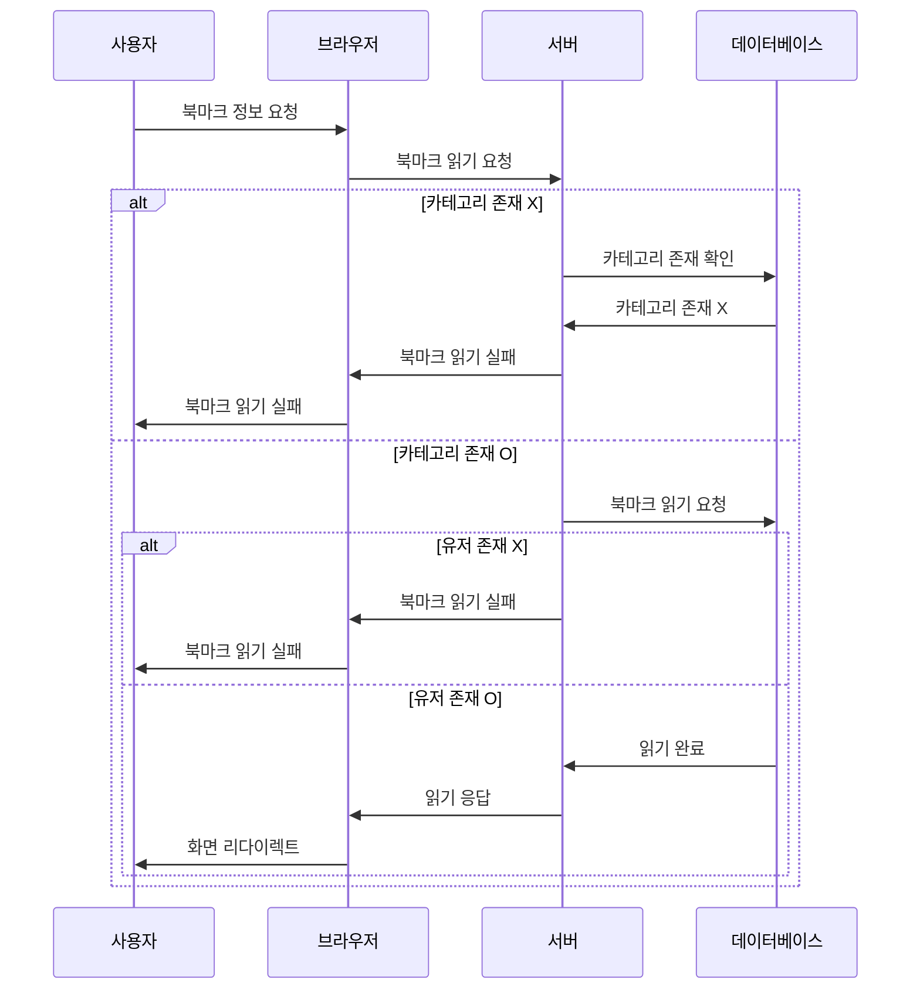

```mermaid
sequenceDiagram
    participant User as 사용자
    participant Browser as 브라우저
    participant Server as 서버
    participant DB as 데이터베이스
    
    User->>Browser: 북마크 정보 요청
    Browser->>Server: 북마크 읽기 요청
    alt 카테고리 존재 X
        Server->>DB: 카테고리 존재 확인
        DB->>Server: 카테고리 존재 X
        Server->>Browser: 북마크 읽기 실패
        Browser->>User: 북마크 읽기 실패
    else 카테고리 존재 O
        Server->>DB: 북마크 읽기 요청
    alt 유저 존재 X
        Server->>Browser: 북마크 읽기 실패
        Browser->>User: 북마크 읽기 실패
    else 유저 존재 O
        DB->>Server: 읽기 완료
        Server->>Browser: 읽기 응답
        Browser->>User: 화면 리다이렉트
    end
    end
``` 
### 제한사항

## 변경예정
