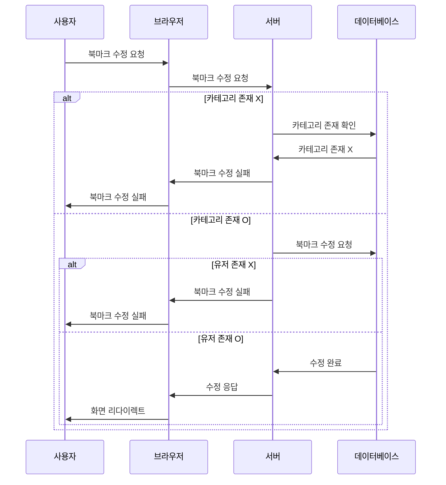

### 제한사항

변경할 때는 Put방식으로 모든 데이터를 서버에게 전송해준다 그럼으로써 if조건문을 제거할 수 있기 떄문에 코드의 간결성이 증가한다.

유효성 조건

### userId

NotEmpty: 유저 아이디를 입력해야 함.

Min(1): 1 이상의 값이어야 함.

### bookmarkId

NotEmpty: 북마크 아이디를 입력해야 함.

Min(1): 1 이상의 값이어야 함.

### title

Size(0, 255): 길이는 0 ~ 255 바이트.

NotBlank: 북마크 명을 입력해야 함.

### link

Size(0, 512): 길이는 0 ~ 512 바이트.
NotBlank: 링크를 입력해야 함.

## 변경예정
- [ ] 인증/인가 구현시 로직 변경