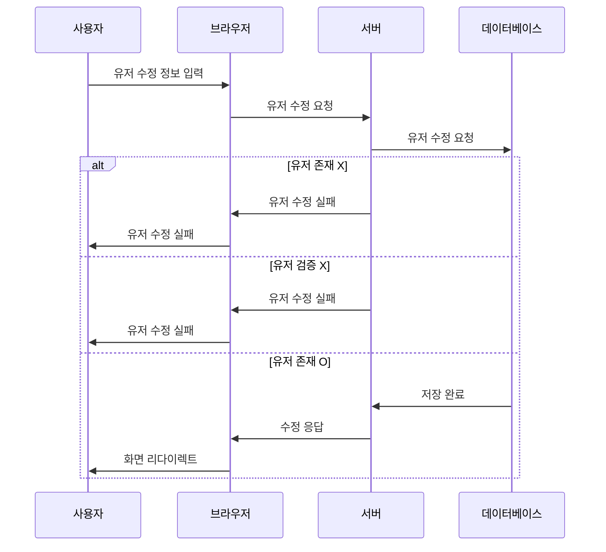

### 제한사항
#### email:
- 공백일 수 없음.
- test@email.com 형식의 이메일 주소여야 함.
#### beforePassword (현재 비밀번호):
- 공백일 수 없음.
- 비밀번호를 반드시 입력해야 함.
#### changePassword (바꿀 비밀번호):
- 공백일 수 없음.
- 비밀번호를 반드시 입력해야 함.
#### userName (사용자 이름):
- 공백일 수 없음.
- 사용하실 이름을 반드시 작성해야 함.
#### userId (유저 아이디):
- 공백일 수 없음.
- 값이 반드시 있어야 하며, 1 이상의 정수여야 함 

## 변경예정
- [ ] 인증/인가 구현 시 적용 