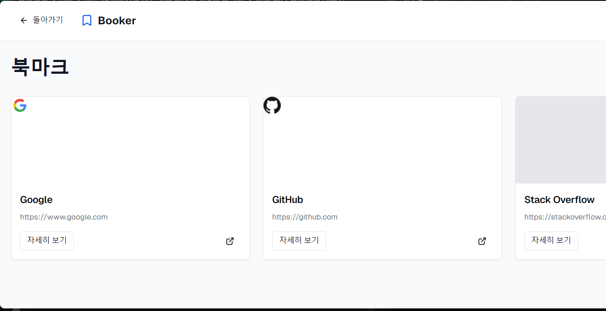

# BookMark

### 만들게 된 계기
여러개의 기기를 사용하다보면 북마크가 서로서로 동기화가 안되어 있어 막상 제가 필요한 
북마크를 찾기 어려웠습니다. 이를 해결하기 위해 웹사이트에서 관리하고자 만들기로 했습니다.

### 디자인 시안

### 사용 기술스택
- Java 17
- Spring Boot 3.3.3
- H2
- Jpa

북마크 수집 페이지 만들기
기능
1. 유저 생성
   - [X] C 
   - [ ] R 
   - [x] U
   - [x] D
1. 카테고리 
   - [X] C 
   - [X] R 
   - [x] U
   - [x] D
2.  북마크 링크 생성 CRUD
    - [x] C 
    - [x] R 
    - [x] U  
    - [x] D
3. 검색해서 카테고리 찾기
4. 최근 사용 북마크

우선순위
### 백엔드
1. - [x] 유저 생성 | 1시간 30분 (exception handler 추가)
2. - [x] 카테고리 생성 | 13시 54분 ~ 14시 39분 (45분) [Flow 차트 확인](./DetailWork/CreateCategory.md)
3. - [x] 북마크 생성 | 14시 40분 ~ 15시 54분 (1시간 14분) [Flow 차트 확인](./DetailWork/CreateBookmark.md)
4. - [x] 카테고리들 읽기 | 1시간 20분
5. - [x] 북마크들 읽기 | 10시 52분 ~ 11시 17분 (25분) [Flow 차트 확인](./DetailWork/ReadBookmark.md)
6. - [x] 북마크 수정 | 11시 30분 ~ 12시 30분 (1시간)[Flow 차트 확인](./DetailWork/UpdateBookmark.md)
7. - [x] 카테고리 수정 | 12시 40분 ~ 13시 (20분) [Flow 차트 확인](./DetailWork/UpdateCategory.md)
8. - [x] 유저 수정 | 17시 ~ 19시 (2시간 테스트 스크립트 리펙토링) [Flow 차트 확인](./DetailWork/UpdateUser.md)
9. - [x] 카테고리 삭제 | 12시 ~ 13시 (1시간) [Flow 차트 확인](./DetailWork/DeleteCategory.md)
10. - [x] 북마크 삭제 | 13시 40분 ~ 14시 10분 (30분) [Flow 차트 확인](./DetailWork/DeleteBookmark.md)
11. - [x] 회원탈퇴 | 14시 15분 ~ 14시 37분 (22분) [Flow 차트 확인](./DetailWork/DeleteUser.md)
12. - [ ] 인증/인가 Kakao OAuth 적용
13. - [ ] 최근 사용 북마크
14. - [ ] 북마크 검색
15. - [ ] 북마크, 카테고리 순서 변경

### 프론트 엔드
1. 메인 페이지 (검색, 최근 사용 북마크)
2. 카테고리 페이지
3. 북마크 페이지
4. 인증/인가 페이지
 
## 코드 작성 스타일

DDD를 사용하지 않고 서비스 코드를 작성하는 이유
초기 개발이기 떄문에 변경으로부터 영향이 적어야 한다고 생각했으며 
외래키를 사용하지 않는 정책에 따라 Lazy Loading과 Eager Loading을 사용할 수 없으면 직접 Dto를 사용하여 맵핑할 것이기 떄문입니다.

## Python 스크립트로 테스트하기
1. 먼저 테스트할 서버를 띄워주세요~
2. Python 인터프리터를 설정해주세요 [블로그](https://jojoldu.tistory.com/465)
3. 스크립트를 실행하면 연속된 스크립트를 실행할 수 있습니다

