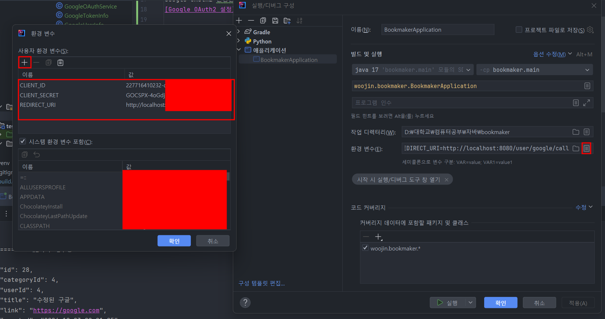
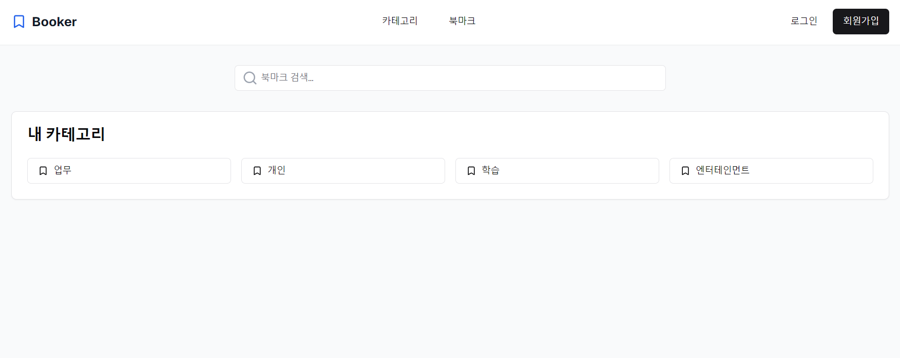
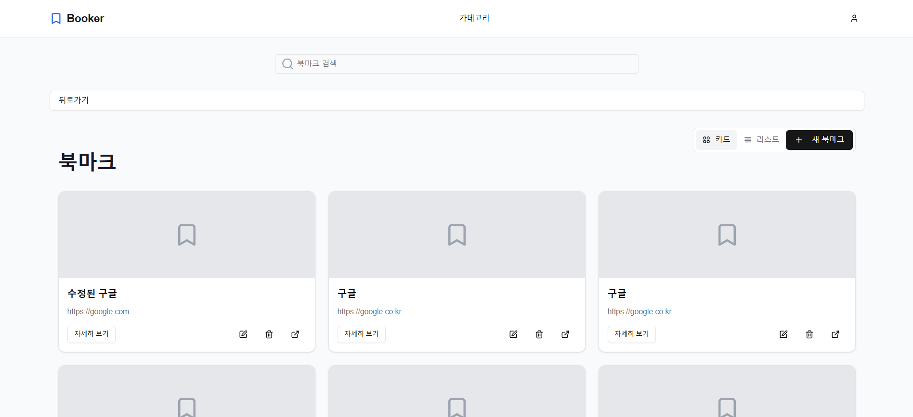
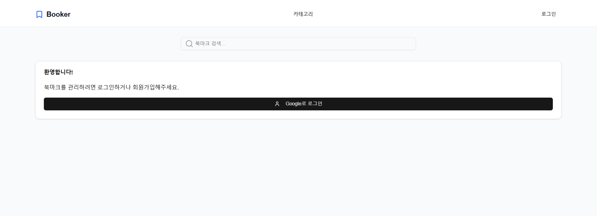

# BookMark

### [K북마크 페이지](http://kbookmark.co.kr)


### 만들게 된 계기
여러개의 기기를 사용하다보면 북마크가 서로서로 동기화가 안되어 있어 막상 제가 필요한 
북마크를 찾기 어려웠습니다. 이를 해결하기 위해 웹사이트에서 관리하고자 만들기로 했습니다.

### 디자인 시안


### 사용 기술스택
- Java 17
- Spring Boot 3.3.3
- H2
- Jpa

### SpringBoot Server 실행 방법 
1. Google OAuth2 생성하기
2. 환경변수 적용하기
[Google OAuth2 설정](https://velog.io/@zini9188/OAuth-%ED%94%84%EB%A1%9C%EC%A0%9D%ED%8A%B8%EC%97%90-OAuth-2.0-%EC%A0%81%EC%9A%A9%ED%95%98%EA%B8%B0)

```yml
spring:
  datasource:
    url: ${DB_URL}
    username: ${DB_USERNAME}
    password: ${DB_PASSWORD}  
  security:
    oauth2:
      client:
        registration:
          google:
            client-id: ${CLIENT_ID}
            client-secret: ${CLIENT_SECRET}
            redirect-uri: ${REDIRECT_URI}
            scope:
              - email
              - profile
```
생성하고 해당 환경변수를 설정해주어야 합니다.
h2 DB를 활성화 하셔서 사용해도 좋고 취향에 맞는 DB를 설정하셔도 좋습니다.

### 환경변수 설정 intellij 실행 방법



### 북마크 수집 페이지 만들기
기능
1. 유저 생성
   - [X] C 
   - [ ] R 
   - [x] U
   - [x] D
1. 카테고리 
   - [X] C 
   - [X] R 
   - [x] U
   - [x] D
2.  북마크 링크 생성 CRUD
    - [x] C 
    - [x] R 
    - [x] U  
    - [x] D
3. 검색해서 카테고리 찾기
4. 최근 사용 북마크

우선순위
### 백엔드
1. - [x] 유저 생성 | 1시간 30분 (exception handler 추가)
2. - [x] 카테고리 생성 | 13시 54분 ~ 14시 39분 (45분) [Flow 차트 확인](./DetailWork/CreateCategory.md)
3. - [x] 북마크 생성 | 14시 40분 ~ 15시 54분 (1시간 14분) [Flow 차트 확인](./DetailWork/CreateBookmark.md)
4. - [x] 카테고리들 읽기 | 1시간 20분
5. - [x] 북마크들 읽기 | 10시 52분 ~ 11시 17분 (25분) [Flow 차트 확인](./DetailWork/ReadBookmark.md)
6. - [x] 북마크 수정 | 11시 30분 ~ 12시 30분 (1시간)[Flow 차트 확인](./DetailWork/UpdateBookmark.md)
7. - [x] 카테고리 수정 | 12시 40분 ~ 13시 (20분) [Flow 차트 확인](./DetailWork/UpdateCategory.md)
8. - [x] 유저 수정 | 17시 ~ 19시 (2시간 테스트 스크립트 리펙토링) [Flow 차트 확인](./DetailWork/UpdateUser.md)
9. - [x] 카테고리 삭제 | 12시 ~ 13시 (1시간) [Flow 차트 확인](./DetailWork/DeleteCategory.md)
10. - [x] 북마크 삭제 | 13시 40분 ~ 14시 10분 (30분) [Flow 차트 확인](./DetailWork/DeleteBookmark.md)
11. - [x] 회원탈퇴 | 14시 15분 ~ 14시 37분 (22분) [Flow 차트 확인](./DetailWork/DeleteUser.md)
12. - [x] 인증/인가 Google OAuth 적용 3일 [Flow 차트 확인](./DetailWork/CreateOAuthUser.md)

### 프론트 엔드
1. 메인 페이지 (카테고리, 검색창, 북마크 모음집) 
2. 카테고리 페이지
    
3. 북마크 페이지
    
4. 인증/인가 페이지
    


### 프론트 기능

1. 인증/인가 페이지
   1. - [x] 화면 구성
   2. - [x] Google OAuth 로그인 연동
   3. - [x] 인증/인가 로직 구현
2. 카테고리 페이지
   1. - [x] 화면 구성
   2. - [x] 카테고리 읽기
   3. - [x] 카테고리 생성
   4. - [x] 카테고리 수정
   5. - [x] 카테고리 삭제
3. 북마크 페이지
   1. - [x] 화면 구성
   2. - [x] 북마크 읽기
   3. - [x] 북마크 카드 형식
   4. - [x] 북마크 생성 (북마크 생성, 수정, 삭제 4시간)
   5. - [x] 북마크 수정
   6. - [x] 북마크 삭제
<br>
- 7일 소요
---


### 프론트 작업 후 작업 예정
13. - [ ] 인증/인가 고도화
    1. - [ ] UserId가 아닌 Token을 통해 권한 인증 
14. - [ ] 배포에 필요한 인프라 및 배포
15. - [ ] 북마크 모음집 실행하기
16. - [ ] 북마크, 카테고리 순서 변경
17. - [ ] 북마크 검색
18. - [ ] 최근 사용 북마크
19. - [ ] 북마크 추천 기능
20. - [ ] 북마크 공유 기능
21. - [ ] 북마크 공동 수정 기능


### 폴더 구조 설계
```commandline
bookmaker
├── common
│   ├── config
│   │   └── RestTemplateConfiguration.java
│   ├── global
│   │   └── ExceptionAdvisor.java
│   └── utils
│       ├── DateUtils.java
│       └── PrintUtils.java
├── controller
│   ├── request
│   │   ├── create
│   │   ├── delete
│   │   ├── read
│   │   └── update
│   ├── response
│   │   ├── create
│   │   ├── delete
│   │   ├── read
│   │   └── update
│   ├── BookmarkController.java
│   ├── CategoryController.java
│   └── UserController.java
├── handler
│   └── service
│       ├── bookmark
│       ├── category
│       ├── oauth
│       └── user
│   └── UserAuthDto.java
│   └── UserAuthHandler.java
└── BookmakerApplication.java
```
- common 패키지는 전역적으로 사용하는 클래스입니다.
- handler 클래스는 여러개의 서비스 클래스를 통합하는 클래스로 비즈니스를 실행시키는 클래스 계층입니다.
이 방식은 서비스끼리의 참조를 하는 참조 순환으로부터 안정적인 특징을 가지고 있습니다.
    - service 클래스는 각각의 도메인에서 수행되는 로직들을 작성했으며 root agregate 개념은 적용하지 않았습니다. 
- controller 패키지의 역할은 입력, 출력, 유효성 검증의 역할을 하고 있다고 생각하기 때문에 분리하게 됐습니다.

각각의 계층에서 dto클래스들을 둔것은 각각의 계층의 변화로부터 영향을 최소화 하기 위함입니다.
service에서는 entity의 최대한의 정보를 반환하고 handler계층에서는 여러 도메인의 데이터를 통합해야할 때 
병합하고 데이터를 반환하고 controller에서는 필요한 데이터만을 전달하도록 설계했습니다.

## Python 스크립트로 테스트하기
1. 먼저 테스트할 서버를 띄워주세요~
2. Python 인터프리터를 설정해주세요 [블로그](https://jojoldu.tistory.com/465)
3. 스크립트를 실행하면 연속된 스크립트를 실행할 수 있습니다

